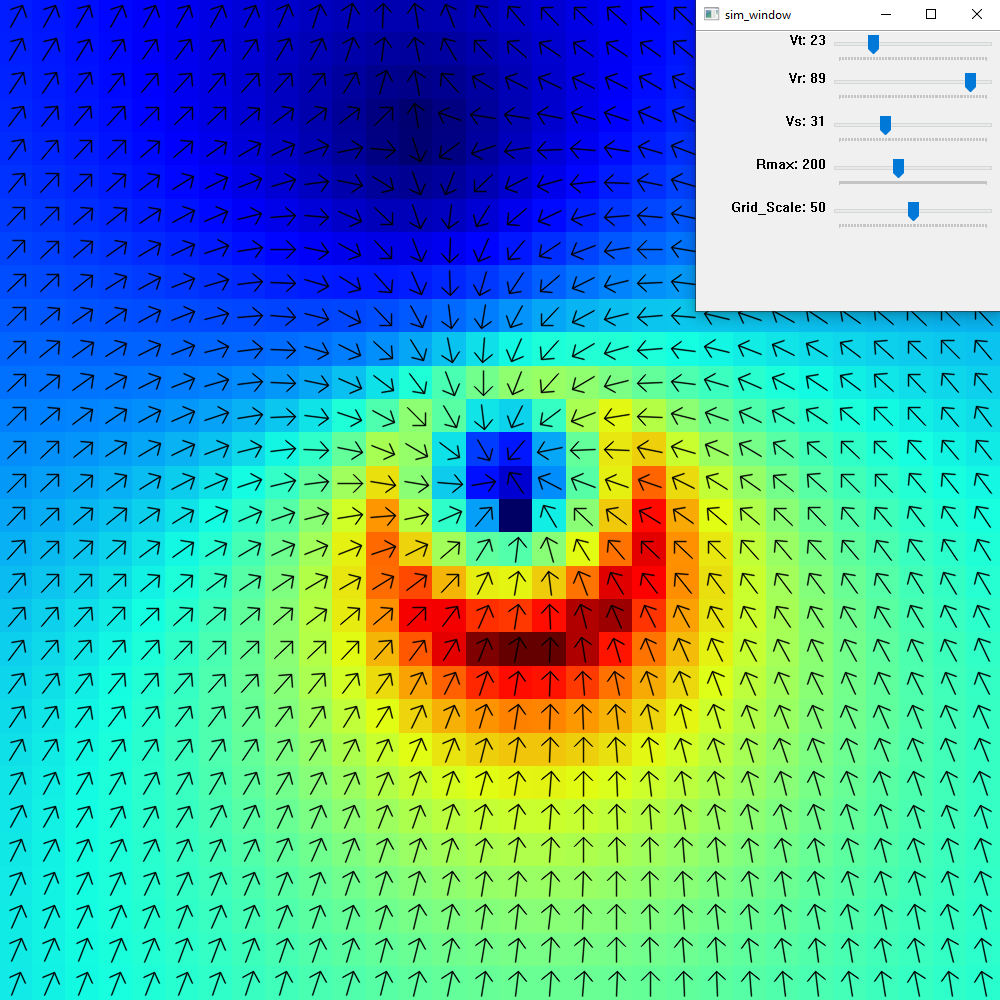
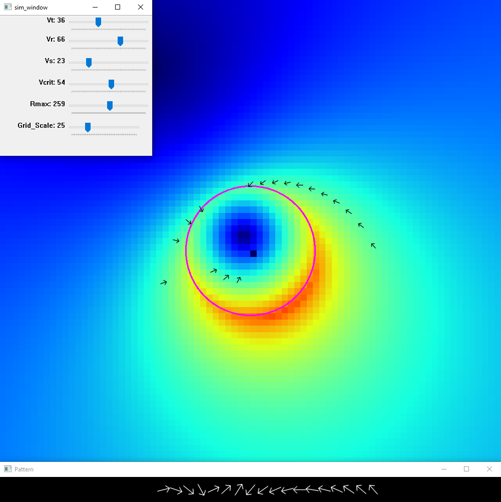

# Rankine_Tornado_Vortex_Solver
 A set of tools for graphing, simulating and solving a Rankine tornado vortex and its tree fall pattern
 

### Daniel Butt, NTP 2023, dbutt7@uwo.ca
 

This work is licensed under a
[Creative Commons Attribution-NonCommercial-ShareAlike 4.0 International License][cc-by-nc-sa].

[![CC BY-NC-SA 4.0][cc-by-nc-sa-image]][cc-by-nc-sa]

[cc-by-nc-sa]: http://creativecommons.org/licenses/by-nc-sa/4.0/
[cc-by-nc-sa-image]: https://licensebuttons.net/l/by-nc-sa/4.0/88x31.png
[cc-by-nc-sa-shield]: https://img.shields.io/badge/License-CC%20BY--NC--SA%204.0-lightgrey.svg

#### Requirements:
opencv (pip install opencv-python)  
numpy (pip install numpy)
 
 
## Grapher

## Simulator

## Solver

